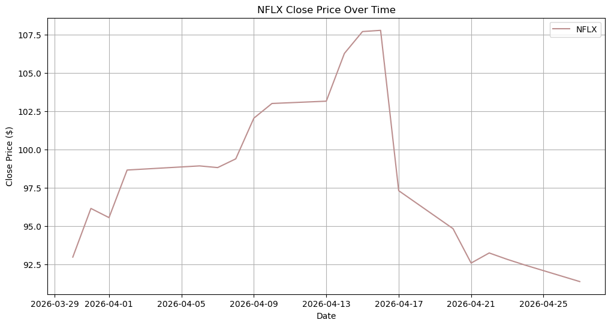
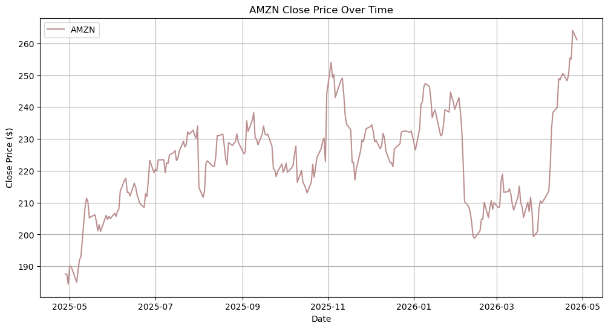
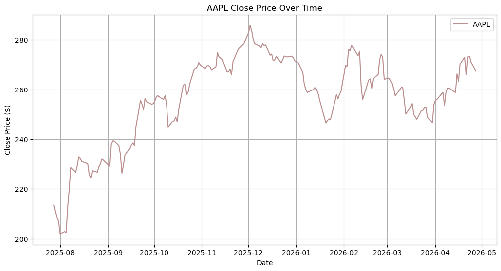
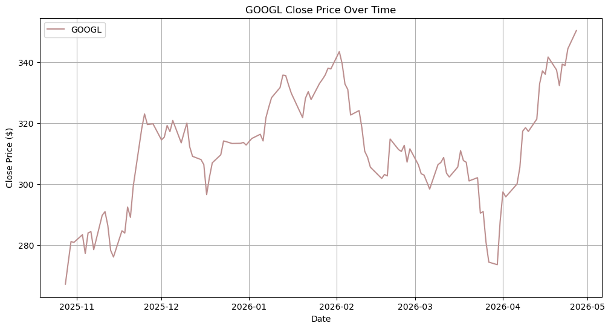
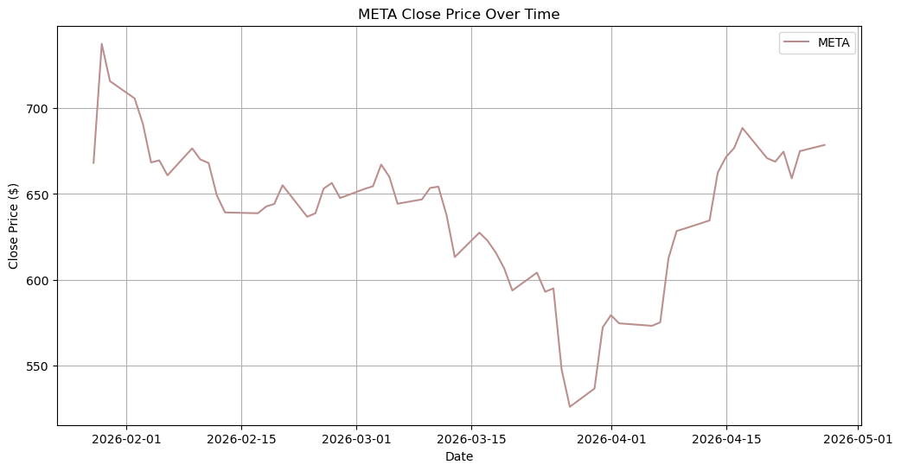

# Data Card

## Dataset Name
KPI Assignment: Stock Price Dataset

## Source of Data

The dataset was collected from Yahoo Finance using the Python library yfinance.
Yahoo Finance provides historical market data for publicly traded companies, including stock prices, dates, closing prices, and other financial information.

For this assignment, only the date and closing price were selected.
The data was automatically downloaded using Python code and then saved in CSV format for further analysis.
  
The companies included in the dataset:
NFLX (Netflix)
DIS (Disney)
GOOGL (Google)
AAPL (Apple)
AMZN (Amazo

Different time periods were selected:

- NFLX – 1 month
- META – 3 months
- GOOGL – 6 months
- AAPL – 9 months
- AMZN – 1 year

| Ticker | Company | Start Date | End Date   |
| ------ | ------- | ---------- | ---------- |
| META   | Meta    | 2025-03-01 | 2026-03-01 |
| AMD    | AMD     | 2025-05-01 | 2026-04-01 |
| NFLX   | Netflix | 2025-07-01 | 2026-04-01 |
| INTC   | Intel   | 2025-09-01 | 2026-04-01 |
| ADBE   | Adobe   | 2025-11-01 | 2026-04-01 |

---
### Basic visualisations 

The following section presents basic visualisations of stock price trends for selected companies. Each chart illustrates the evolution of closing prices over time.
The graphs display closing prices for each company, helping to identify trends, fluctuations, and potential anomalies in the data.

## KPI Results

### (a) Completeness

All datasets had 0 missing values.  
Completeness for all companies was 100%.

### (b) Latency

The latest available stock prices were recent and up to date.
The starting dates also correctly matched the selected time periods for each company.

### (c) Accuracy

No negative prices were found.  
No zero prices were found.  
Accuracy was 100% for all datasets.

### (d) Consistency

All datasets had the same column structure:
      
Date
Close
      
The closing prices were stored in the same numeric format in every file.
Therefore, the datasets consistent and easy to compare.

---

## Conclusion

The dataset quality was high.  
All KPI evaluations showed strong results.  
The data was complete, recent, accurate, and consistent.  

Yahoo Finance data is suitable for stock price analysis.
